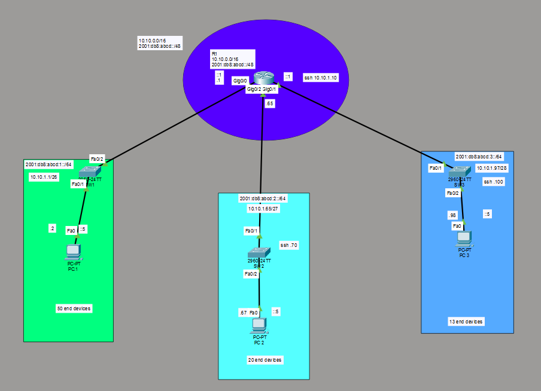
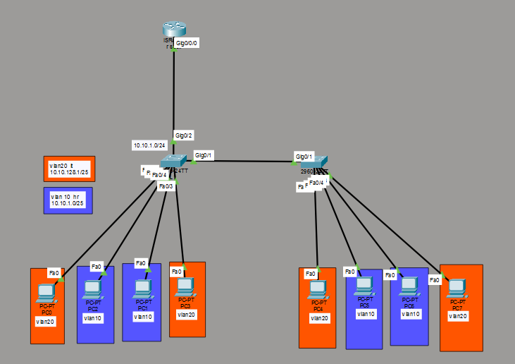
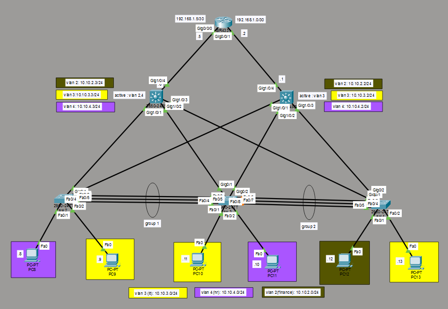

<p align="center">

</p>

<p align="center">

</p>

---

# 👨‍💻 Mahmoud Reda

💻 IT & Network Engineer
🌍 Egypt
🌐 Networking | Infrastructure | Network Security

Passionate about designing and building **secure and scalable enterprise networks**.

---

# 💻 Network Engineer Console

```bash
Router> enable
Router# show engineer-profile

Engineer Name : Mahmoud Reda
Role          : IT & Network Engineer
Location      : Egypt

Capabilities:
 - Routing & Switching
 - VLAN Segmentation
 - EtherChannel
 - HSRP Redundancy
 - Spanning Tree Protocol
 - Network Security
 - SSH Hardening

Tools:
 - Cisco Packet Tracer
 - GNS3
 - Wireshark
 - Linux

Mission:
 Building enterprise network labs
 simulating real production environments.
```

---

# 🧠 Networking Skills

<p align="center">


</p>

---

# 🧪 Network Lab Projects

| Project                   | Description                               | Technologies    |
| ------------------------- | ----------------------------------------- | --------------- |
| Enterprise Network Design | Full enterprise topology with departments | VLAN, Routing   |
| VLAN Segmentation Lab     | Network segmentation using VLANs          | VLAN, Trunk     |
| Hierarchical Network      | Core & Access Layer architecture          | STP, Redundancy |

---

# 🖧 Network Topologies

## 🌐 Enterprise Network Design

<p align="center">

</p>

Features:

• IPv4 & IPv6 addressing
• Department segmentation
• SSH management
• Layer2 switching

---

## 🧩 VLAN Segmentation Lab

<p align="center">

</p>

Features:

• VLAN10 / VLAN20
• Trunk links
• Inter-VLAN routing

---

## 🏢 Hierarchical Enterprise Network

<p align="center">

</p>

Features:

• Core layer
• Access layer
• Redundant paths
• Enterprise architecture

---

# 🎓 Certifications & Courses

• CCNA Foundations – Networking Basics and Cisco IOS Essentials (Coursera – 2025)
• CCNA Intermediate – Switching, VLANs & Routing (Coursera – 2025)
• CCNA Advanced – WAN, Security, and Network Services (Coursera – 2025)
• Networking Basics – Cisco Networking Academy (2025)
• Penetration Testing – edX (2024)
• Digital Marketing – YouTube (2024)
• Media Buying – YouTube (2024)
• Microsoft SQL Server – M3aarf (2023)
• Computer Networks – M3aarf (2023)
• HR Management – M3aarf (2023)
• C Programming – Gammal Tech (2022)
• Basics of IT – Coursera (2018)
• ICDL – Edraak (2018)

---

# 🛠 Tools & Platforms

<p align="center">

</p>

Networking tools:

• Cisco Packet Tracer
• GNS3
• Wireshark

---

# 📊 GitHub Stats

<p align="center">


</p>

---

# 📈 Contribution Graph

<p align="center">

</p>

---

# 🔗 Connect With Me

<p align="center">

<a href="https://www.linkedin.com/in/mahmooudreda">

</a>

<a href="https://www.facebook.com/MA7M0O0O0UD">

</a>

</p>

---

⭐ Always building networking labs and improving my IT skills
